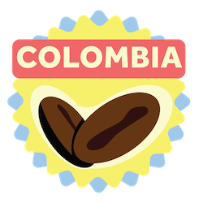

<h4>FLAVOR PROFILE</h4>
"Bold( texture and intensity), sweet. Grapes, Berries. Often an enjoyable liquor-like quality. Medium acidity." –Michael Mac Donald, Medium
<h4>ABOUT</h4>
"The high volume of crops grown in the country (Colombia grew almost 10% of the coffee in the entire world in 2015) means that these premium Arabica beans are also some of the most aggressively priced on the market, and serve as a base for many brands' blends.

The drawback to how common these beans are is that many people will find them very "mild" as they're used to the flavor." –Espresso Coffee Guide

<h4>NOTES</h4> 
information sourced directly from https://medium.com/@mmdsl28/coffee-flavour-characteristics-by-country-97f341f73deb and https://espressocoffeeguide.com/gourmet-coffee/coffees-of-the-americas/colombian-coffee/