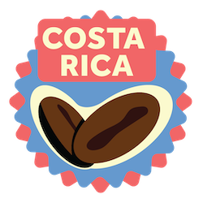

<h4>FLAVOR PROFILE</h4>
"Elegant, milk-chocolate, floral, stone-fruit, balanced. Mild acidity." –Michael Mac Donald, Medium
<h4>ABOUT</h4>
"Costa Rican coffees are generally believe to have some of the best coffee flavor profiles in south/central America, with high grown altitudes and a pleasant acidity, leading to great coffee reviews. The reputation has also resulted it being introduced to Starbucks under their "reserve" program. Its defining tasting notes include a brown-sugary sweetness, citrusy notes and apricot-like fruity flavors." –Espresso Coffee Guide

<h4>NOTES</h4> 
information sourced directly from https://medium.com/@mmdsl28/coffee-flavour-characteristics-by-country-97f341f73deb and https://espressocoffeeguide.com/gourmet-coffee/coffees-of-the-americas/costa-rica-coffee/